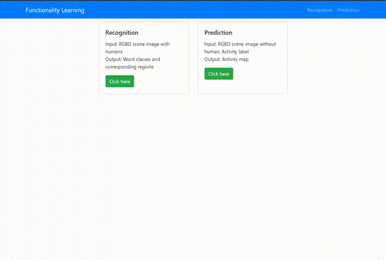

# Functionality Learning App

A User Interface for activity recognition and activity prediction


## Overview

1. Activity recognition
    - Input: RGBD image with humans in the scene rendered from SUNCG. The image shape is (H,W,4). The image values belong to [0,1]. The depth of the ceiling and outside area are 0.0, and the depth of the floor is 1.0.
    - Output: Words of activity label and peak response maps corresponding to the word. The value of each pixel of the word map represents the probability of the word at that position.

2. Activity prediction
    - Input: Activity label and RGBD image without human in the scene rendered from SUNCG. The image shape is (H,W,4). The image values belong to [0,1]. The depth of the ceiling and outside area are 0.0, and the depth of the floor is 1.0.
    - Output: Activity map. The value of each pixel of the activity map represents the probability of the activity at that position.


## Usage

1. Create a fresh venv (with conda or virtualenv) and activate it:

```
conda create -n activity python==3.7.6
conda activate activity

# create venv use requirements.txt, then skip step 2
# conda create --name activity --file requirements.txt 
```

2. Install the requirements:

```
conda install -c conda-forge dash-bootstrap-components scikit-image
# conda install pytorch torchvision cudatoolkit=9.2 -c pytorch
# conda install pytorch torchvision cudatoolkit=10.1 -c pytorch
conda install pytorch torchvision cudatoolkit=10.2 -c pytorch
pip install dash-canvas==0.1.0
```

3. Start the app:

```
python index.py
```

4. Try the app at `localhost:8050`! 

    - Activity Recognition: Drag and drop an image with humans into the upload box and wait the class buttons to show up. Click the class button to see the peak response map.
    - Activity Predition: Drag and drop an image without human into the upload box and select an activity label. Then wait the preditiction result to show up.


